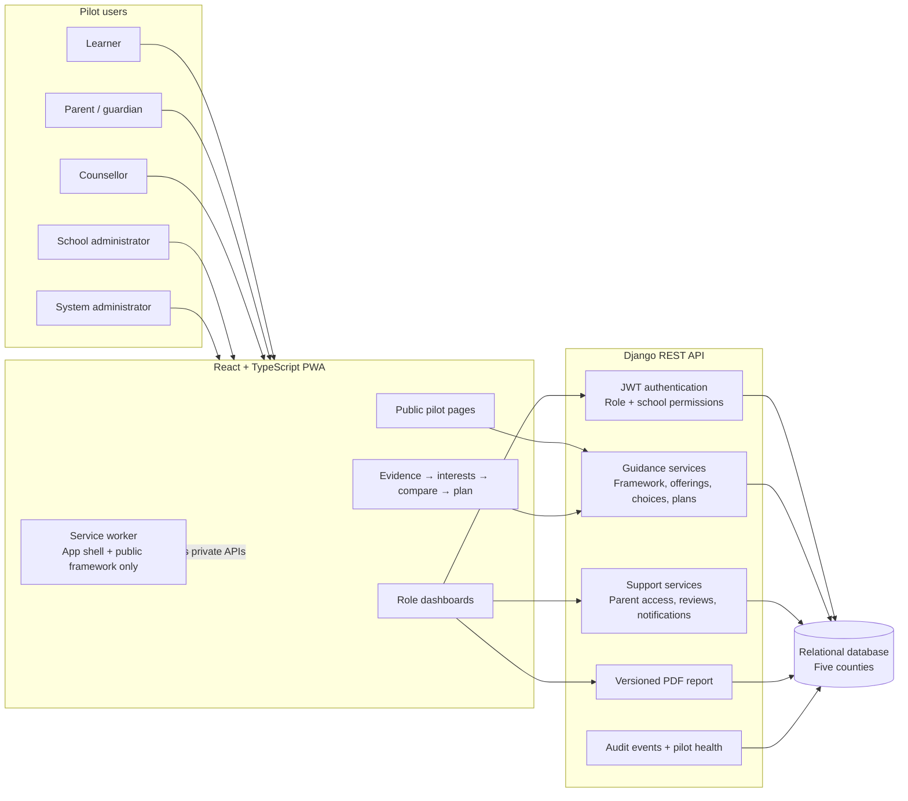

# Pilot architecture — one-page presentation view

Smart Ashauri is a five-county decision-support pilot. It helps a learner combine
academic evidence, stated interests, available subject combinations and human review.
It does not make placement or eligibility decisions.

## Trust boundaries

- Public framework data may use short-lived network-first caching.
- Authenticated API responses are never placed in runtime Cache Storage.
- Assessment drafts are user-scoped in the browser and expire after seven days.
- Every private route checks authentication and role; school operations also enforce
  school scope and active membership.
- The PDF records evidence sources, framework/instrument/algorithm versions and an
  advisory disclaimer.

## Pilot boundary

The data model and public copy are limited to Kiambu, Murang'a, Nyeri, Kirinyaga and
Nyandarua. The current catalogue is curated and versioned for the final-project pilot,
not represented as a national placement service.

