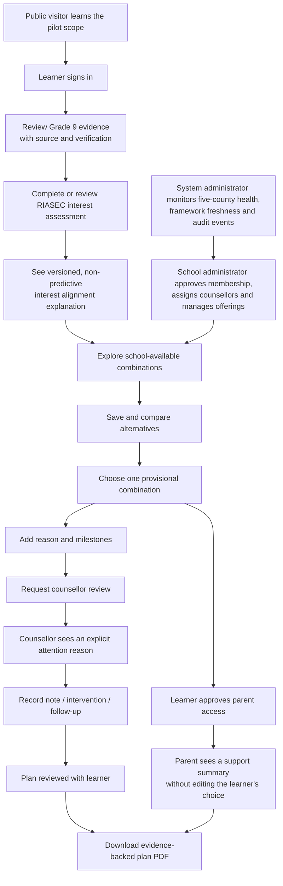

# Pilot user flow — one-page presentation view

> **Audit status (2026-07-31):** This is the intended user flow. The audit will
> compare every step with the behavior currently implemented on `main` and with
> the verified official Senior School guidance process.

## Decision ownership

| Actor | Can do | Cannot do |
|---|---|---|
| Learner | Own evidence, assessment, saved/provisional choice and plan | Treat interest alignment as placement |
| Parent/guardian | View an approved summary and support next steps | Change the learner's provisional choice |
| Counsellor | Review evidence, document a note/intervention and follow up | Silently decide for the learner |
| School administrator | Manage school membership, assignments and offerings | Access another school's private records |
| System administrator | Monitor pilot health, catalogue status and audit events | Convert the pilot into an official placement decision |
